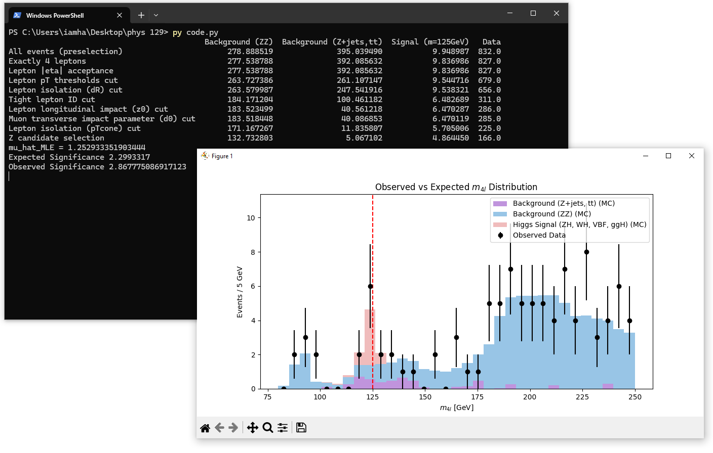

# Data Requirements

To run the analysis, **you must download the following ROOT files** from the official CERN Open Data portal and place them in the same directory as `code.py`:

**Download page:** [https://opendata.cern/record/15005](https://opendata.cern/record/15005)

## Required Files

### **Real Data Files**

These contain four-lepton candidate events collected during different ATLAS data-taking periods:

| File Name          | Description                                     |
| ------------------ | ----------------------------------------------- |
| `data_A.4lep.root` | ATLAS Run A data containing 4-lepton candidates |
| `data_B.4lep.root` | ATLAS Run B data containing 4-lepton candidates |
| `data_C.4lep.root` | ATLAS Run C data containing 4-lepton candidates |
| `data_D.4lep.root` | ATLAS Run D data containing 4-lepton candidates |

---

### **Signal Monte Carlo Samples**

| File Name                            | Description                                |
| ------------------------------------ | ------------------------------------------ |
| `mc_341947.ZH125_ZZ4lep.4lep.root`   | ZH associated production                   |
| `mc_341964.WH125_ZZ4lep.4lep.root`   | WH associated production                   |
| `mc_344235.VBFH125_ZZ4lep.4lep.root` | Vector Boson Fusion                        |
| `mc_345060.ggH125_ZZ4lep.4lep.root`  | Gluon–gluon fusion                         |

---
### **Background Monte Carlo Samples**

| File Name                  | Description                             |
| -------------------------- | --------------------------------------- |
| `mc_363490.llll.4lep.root` | Irreducible 4-lepton background         |
| `mc_410000.ttbar_lep.4lep.root` | Leptonic $t\bar{t}$ background       |
| `mc_361108.Ztautau.4lep.root`    | $Z \rightarrow \tau\tau$ background ($Z+$jets) |
| `mc_361107.Zmumu.4lep.root`      | $Z \rightarrow \mu\mu$ background ($Z+$jets)  |
| `mc_361106.Zee.4lep.root`        | $Z \rightarrow ee$ background ($Z+$jets)      |

---

# Running the Analysis

Below is an example screenshot showing what a successful execution of the `code.py` analysis script looks like:

---

